# python_dataviz

# Panida Thaprakhon 603020475-7
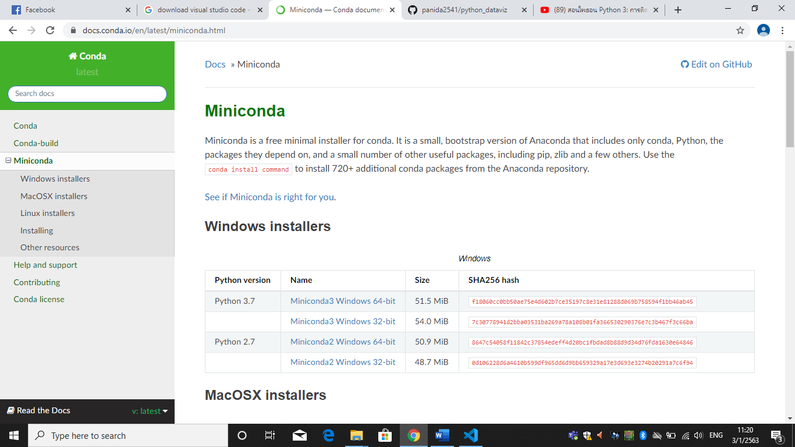
# 1.ทำการดาวโหลด miniconda python 3.7  เลือกขนาด bit ตามเครื่องของตนเอง แล้วคลิกดาวโหลด เสร็จแล้วทำการรันโปรแกรมแล้ว

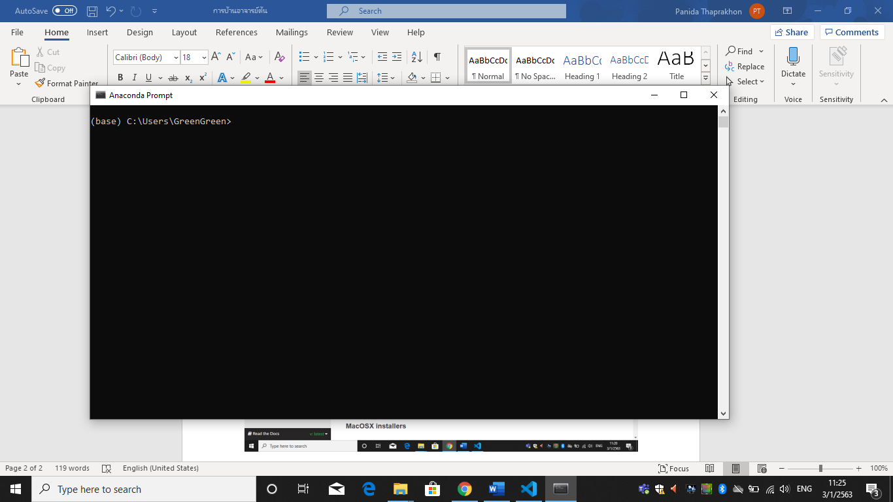
# 2.ค้นหาโปรแกรมชื่อว่า Anaconda Prompt

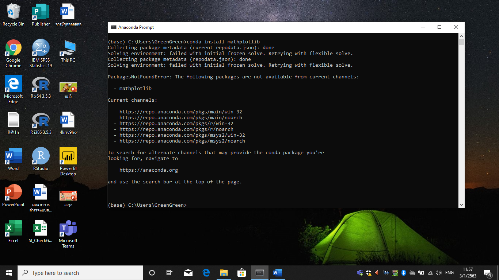
# 3.Install mathplotlib ใช้คำสั่ง conda install mathplotlib

# 4.Install jupyter ใช้คำสั่ง conda install jupyter

# 5.วิธีการทำกับ Google colab ให้ทำการ sign in e-mail เพื่อเข้าใช้ Google colab บนอินเทอร์เน็ต  กด new python3 notebook  แล้วทำการเปลี่ยนชื่อ “…..”

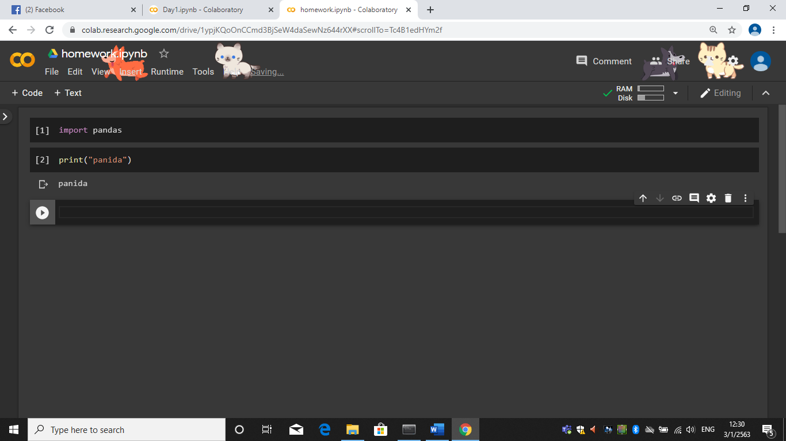
# 6.ทำการใส่โค้ดตามภาพ

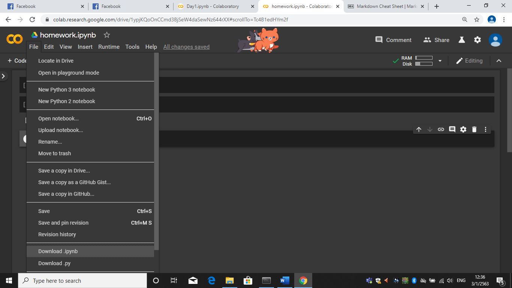
# 7.File>Downlond.ipynbเพื่อดาวโหลดลงเครื่องไปเก็บไว้ยังโพลเดอร์ที่เราต้องการ

 [title](https://github.com/)
# 8.ใช้สั่งงานและใช้เก็บ

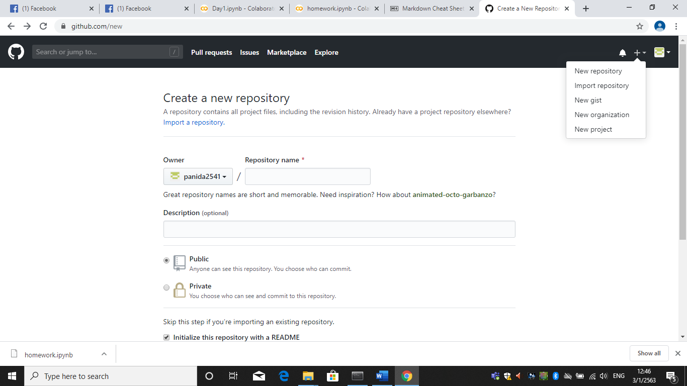
# 9.จากนั้นทำการสมัครการใช้งาน กด sign up ทำการสมัครแล้วก็มาเลือกNew repository>ตั้งชื่องาน>ติกเครื่องหมายถูก>Create repository

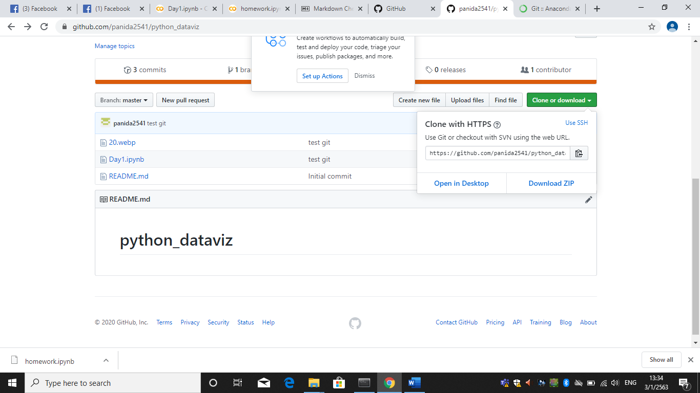
# 10.ทำการคัดลอกลิ้ง clone or downlond 

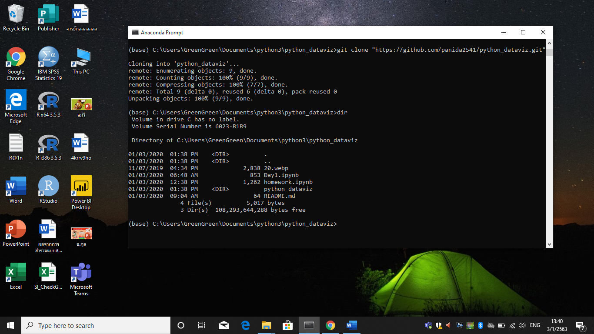
# 11.ใช้คำสั่ง git clone https://github.com/panida2541/python_dataviz.git ใช้คำสั่ง dir ดูโฟลเดอร์ว่ามีชื่อโฟลเดอร์อะไรบ้าง

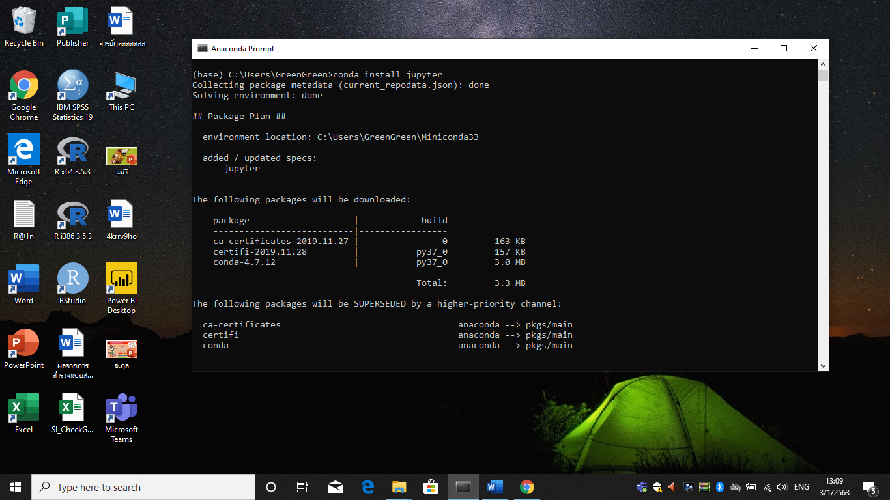
# 12. Anconda Install git ใช้คำสั่ง conda install -c anaconda git

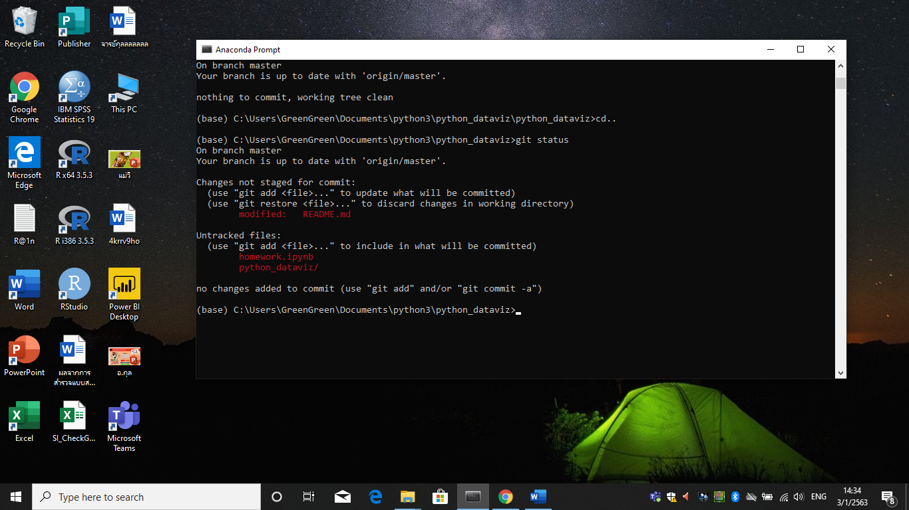
# 13.ทำการใช้คำสั่ง git status

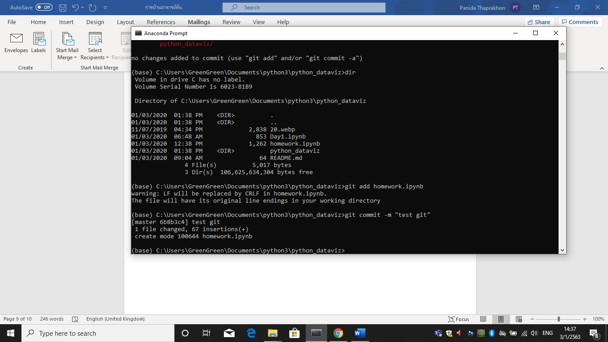
# 14.git add โดยใช้คำสั่ง git add ตามด้วยชื่อโฟลเดอร์ที่ต้องการ เช่น git add homework.ipynb จากนั้นใช้คำสั่ง git commit -m “test git”

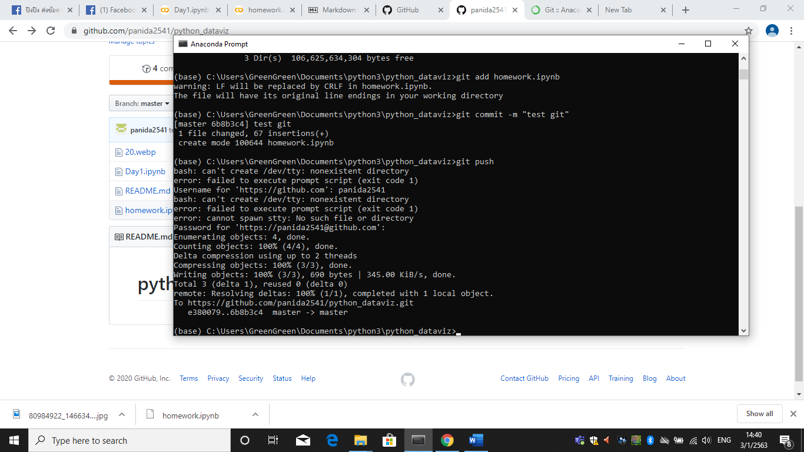
# 15.ใช้คำสั่ง Git push เพื่อเชื่อมบนอินเทอร์เน็ต จากนั้นใส่ Username และpassword ที่เราตั้งไว้บนเว็บ ก็จะเชื่อมไปยังเว็บที่เก็บข้อมูล 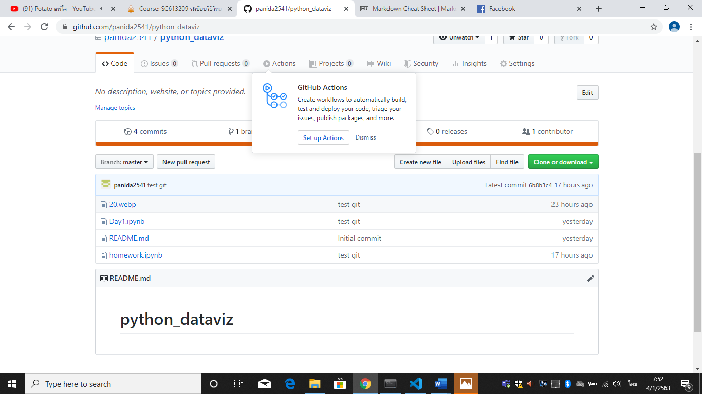

